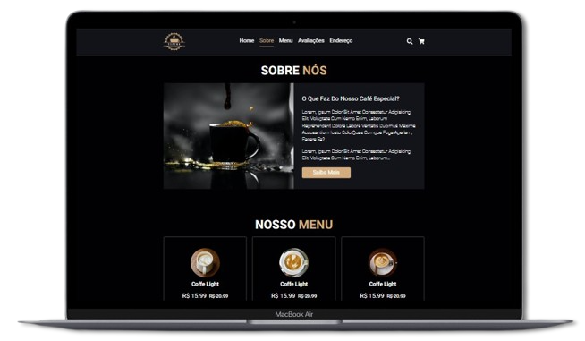
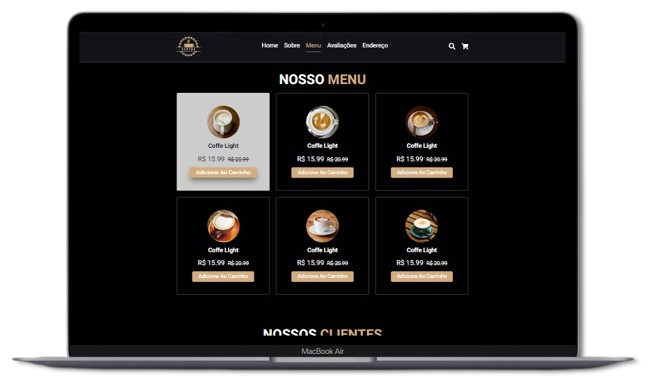
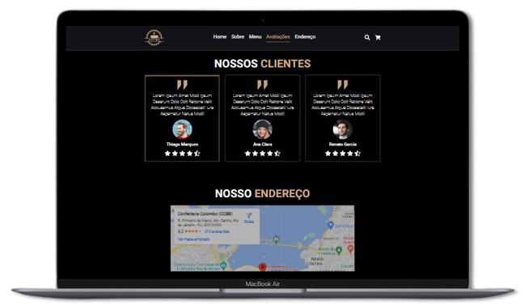

## Cafeteria Dev

Este é um projeto layout de um site de cafeteria utilizando o [Vite](https://vitejs.dev/). 
Contendo no corpo da página as suas seções, sendo elas:

- Home
- Sobre
- Menu
- Avaliações
- Endereço
- Redes sociais

&nbsp;
## 👨🏻‍💻 Começando...

Primeiro, execute os seguintes comandos no cmd:

```bash
npm install
```
```bash
npm run dev
```

Digite no seu navegador a URL `http://localhost:3000` para ver o projeto.

&nbsp;
## 💻 Layouts do projeto

&nbsp;  
| Home | Sobre |
|---|---|
|  |  |

&nbsp;
| Menu | Avaliações |
|---|---|
|  |  |

&nbsp;
| Endereço e Redes Sociais |
|---|
|  |